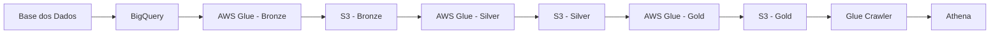
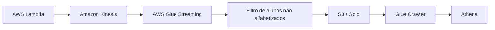

# Tech Challenge – Fase 2

## Pipeline Híbrida para Análise da Alfabetização no Brasil

Este projeto implementa uma pipeline híbrida de dados, combinando **processamento Batch e Streaming**, para integrar diferentes fontes relacionadas ao indicador de alfabetização no Brasil.

O objetivo é construir uma solução em ambiente de nuvem capaz de **integrar dados de diferentes fontes, aplicar transformações e validações, disponibilizar informações analíticas e manter uma arquitetura com preocupação em qualidade, escalabilidade e eficiência de custos**.

A solução foi implementada na **AWS**, utilizando principalmente **AWS Glue, Amazon S3, AWS Lambda, Amazon Kinesis, AWS Secrets Manager, AWS IAM, AWS Glue Crawlers e Amazon Athena**.

---

## 1. Contexto do problema

A alfabetização infantil é um importante indicador educacional e seu acompanhamento exige a integração de diferentes fontes de dados. Uma análise adequada precisa permitir observar os resultados alcançados e compará-los com valores de referência, como as metas estabelecidas para o processo de alfabetização.

Neste projeto, a pipeline foi construída para organizar essas informações em diferentes níveis de processamento, permitindo gerar visualizações analíticas para comparação de resultados, evolução temporal e análise regional.

O projeto utiliza como fonte principal os dados disponibilizados pela **Base dos Dados**, acessados por meio do **BigQuery**.

---

## 2. Objetivo

O objetivo é construir uma **pipeline híbrida de dados (Batch + Streaming)** capaz de integrar diferentes fontes relacionadas ao indicador de alfabetização, garantindo:

- qualidade dos dados;
- escalabilidade;
- eficiência de custos;
- processamento em ambiente de nuvem;
- disponibilidade de dados tratados para análise.

A solução segue uma arquitetura de dados baseada no conceito de **Medallion Architecture**, com as camadas **Bronze, Silver e Gold**.

---

## 3. Arquitetura da solução

A arquitetura principal do projeto utiliza AWS como plataforma de cloud.

### Batch



A execução das etapas Batch é orquestrada por um **AWS Glue Workflow**.

### Streaming



O fluxo de Streaming tem finalidade didática e de demonstração da arquitetura de ingestão por eventos. Os eventos são mockados e não são incorporados ao processamento Batch nem utilizados para alterar as tabelas reais das camadas Bronze e Silver.

---

## 4. Tecnologias utilizadas

### AWS Glue

O AWS Glue é utilizado para:

- processamento das etapas Batch;
- implementação das transformações das camadas Bronze, Silver e Gold;
- execução do consumidor de Streaming.

A escolha do Glue ocorreu por ser um serviço gerenciado, conhecido pela equipe, amplamente utilizado no mercado e com configuração relativamente simples e amigável.

### Amazon S3

O Amazon S3 é utilizado como armazenamento das camadas Bronze, Silver e Gold.

Foi escolhido por:

- simplicidade de utilização;
- baixo custo;
- ampla adoção no mercado;
- facilidade de integração com os demais serviços utilizados, especialmente Glue e Athena.

### AWS Secrets Manager

O Secrets Manager é utilizado para armazenar e fornecer de forma segura as credenciais necessárias para acesso às fontes GCP/BigQuery.

A utilização de um serviço de gerenciamento de segredos evita manter credenciais diretamente no código e segue uma estratégia comum de segurança em ambientes profissionais.

### AWS Lambda

A Lambda é utilizada para gerar eventos mockados de alunos no fluxo de Streaming.

Foi escolhida por ser um serviço serverless, simples de configurar, de baixo custo para o cenário proposto e com integração fácil com os demais serviços AWS.

### Amazon Kinesis

O Kinesis é utilizado como canal de transmissão dos eventos de Streaming entre a Lambda e o Glue Streaming.

A escolha ocorreu pela facilidade e rapidez de criação e configuração e pela integração com os demais serviços AWS.

Inicialmente foi considerada a utilização de Kafka, porém sua configuração se mostrou mais complexa para o escopo do projeto, exigindo a criação e configuração de cluster e infraestrutura de rede. O Kinesis apresentou uma alternativa gerenciada e mais simples para a demonstração de Streaming.

### AWS IAM

O IAM é utilizado para criação das permissões necessárias aos componentes da pipeline.

Foi adotada uma estratégia de **uma role por serviço**, permitindo que cada componente tenha acesso somente aos recursos necessários para sua execução.

### AWS Glue Crawlers e Amazon Athena

Os Glue Crawlers são utilizados para catalogar os arquivos armazenados no S3.

O Athena permite realizar consultas SQL diretamente sobre os dados catalogados.

A combinação foi escolhida por ser simples, amplamente utilizada e adequada ao pequeno volume de dados do projeto, além de facilitar a validação dos resultados produzidos pela pipeline.

---

## 5. Fontes de dados

A pipeline Batch utiliza sete fontes:

1. **UF**
2. **Município**
3. **Alunos**
4. **Meta Alfabetização Brasil**
5. **Meta Alfabetização por UF**
6. **Meta Alfabetização por Município**
7. **Dicionário**

As seis primeiras correspondem às entidades solicitadas no desafio. A tabela `dicionario` foi incluída como uma fonte auxiliar disponível no mesmo dataset e pode ser utilizada para relacionar e interpretar valores.

Todas essas fontes são obtidas a partir da **Base dos Dados**, utilizando o BigQuery como origem.

---

## 6. Arquitetura Medallion

A solução utiliza três camadas principais:

```text
              ┌───────────────┐
              │     Bronze    │
              │ Dados brutos  │
              └───────┬───────┘
                      │
                      ▼
              ┌───────────────┐
              │     Silver    │
              │ Dados tratados│
              └───────┬───────┘
                      │
                      ▼
              ┌────────────────┐
              │      Gold      │
              │ Dados analíticos│
              └────────────────┘
```

### 6.1 Bronze

A Bronze representa a entrada dos dados no Data Lake.

O processamento segue o fluxo:

```text
Extract → Transform → Load
```

#### Extract

Os dados são extraídos das tabelas do BigQuery.

As credenciais necessárias são disponibilizadas de maneira segura utilizando **AWS Secrets Manager** e a configuração de conexão utilizada pelo Glue.

#### Transform

Os dados recebem metadados técnicos necessários para rastreabilidade e auditoria, incluindo informações de ingestão e particionamento.

Entre os metadados utilizados estão informações como:

- `_ingested_at`
- `_job_name`
- `_source`
- `_year`

Também são executadas algumas validações básicas de qualidade.

#### Load

Os dados são gravados no Amazon S3 em **formato Parquet**, particionados por ano.

Exemplo:

```text
s3://bucket/etl/bronze/uf/_year=2023
```

A Bronze tem como objetivo preservar os dados de entrada e manter informações técnicas que permitam rastreabilidade do processamento.

---

### 6.2 Silver

A Silver recebe os dados armazenados na Bronze.

Nesta etapa são realizadas as principais normalizações e transformações necessárias para preparar os dados para consumo analítico.

Entre as atividades realizadas estão:

- padronização e transformação de tipos;
- normalizações;
- aplicação de regras de transformação;
- validações básicas;
- preparação das informações utilizadas posteriormente pela Gold.

Exemplo de armazenamento:

```text
s3://bucket/etl/silver/alunos/_year=2024
```

A Silver concentra os dados já tratados, mantendo uma estrutura mais adequada para integração e utilização nas análises posteriores.

---

### 6.3 Gold

A Gold representa a camada analítica.

Diferentemente da Silver, a Gold não é apenas uma versão adicionalmente tratada das mesmas tabelas. Nesta camada são combinadas as fontes necessárias e executadas consultas mais complexas, utilizando filtros, joins, agregações e cálculos específicos para gerar **produtos analíticos**.

As visualizações produzidas são:

#### `resultado_uf_ano`

Permite comparar o resultado de alfabetização de cada estado em determinado ano com a meta correspondente ao mesmo ano.

#### `comparativo_anual_uf`

Permite comparar os resultados dos estados entre um ano e o ano seguinte, possibilitando acompanhar a evolução temporal.

#### `media_regiao_ano`

Calcula a média ponderada da taxa de alfabetização por região e ano.

#### `alunos_analfabetos`

Contém a lista de alunos considerados não alfabetizados no fluxo de Streaming mockado.

Exemplo:

```text
s3://bucket/etl/gold/alunos_analfabetos/_year=2025
```

---

## 7. Regra de referência do indicador

Um dos valores de referência utilizados no projeto é o ponto de corte de **743 pontos de proficiência**, estabelecido para o indicador de alfabetização.

O conceito utilizado na análise é:

```text
proficiência >= 743
        ↓
    alfabetizado
```

Essa referência permite transformar o resultado de proficiência em uma classificação utilizada nas análises.

---

## 8. Integração das fontes

As análises da Gold utilizam diferentes conjuntos de dados.

Entre os principais relacionamentos estão:

```text
Resultados por estado
        │
        ├──────────► Metas
        │
        └──────────► Comparações temporais


Dados por aluno
        │
        ▼
Arquivo auxiliar
município → estado → região
        │
        ▼
Análises regionais
```

A integração permite relacionar resultados educacionais com informações territoriais e metas de referência.

A tabela `dicionario` também é armazenada no S3 e utilizada pelos pipelines que necessitam relacionar ou interpretar informações.

---

## 9. Ingestão Batch

A ingestão Batch foi escolhida como estratégia principal para as fontes históricas.

Essas fontes são caracterizadas por dados que não exigem atualização contínua em tempo real. Dessa forma, o processamento periódico dos dados é suficiente para o objetivo da solução.

O fluxo é:

```text
BigQuery
   ↓
Glue Bronze
   ↓
S3 Bronze
   ↓
Glue Silver
   ↓
S3 Silver
   ↓
Glue Gold
   ↓
S3 Gold
   ↓
Crawler
   ↓
Athena
```

A execução é coordenada por um **AWS Glue Workflow**.

---

## 10. Ingestão Streaming

O Streaming foi implementado para praticar o conceito de processamento de eventos em tempo quase real.

A Lambda gera eventos mockados de alunos e os envia ao Kinesis.

O Glue Streaming consome esses eventos e aplica um filtro baseado no atributo `alfabetizado`, mantendo os alunos não alfabetizados.

O resultado é disponibilizado em uma tabela/visualização específica de alunos não alfabetizados.

### Por que o Streaming não utiliza Bronze e Silver?

Os eventos utilizados nesse fluxo são **mockados e foram criados exclusivamente para demonstrar a ingestão via Streaming**. Por esse motivo, eles são mantidos separados do fluxo principal de dados reais, evitando misturar dados simulados com os dados utilizados nas análises do Batch.

Dessa forma, o fluxo de Streaming possui finalidade demonstrativa e não interfere no conjunto de dados real utilizado pelas análises.

---

## 11. Data Quality

A pipeline possui mecanismos básicos de validação de qualidade de dados.

### Batch

Nos jobs Batch, algumas colunas possuem regras de validação, principalmente verificações de valores não nulos.

As regras são configuradas para que, em caso de falha, o processamento seja interrompido.

Essa estratégia evita que dados que não atendam aos critérios mínimos de qualidade avancem para as etapas seguintes.

### Gold

Na construção das visualizações analíticas são realizadas verificações e tratamentos adicionais, incluindo:

- remoção de registros duplicados;
- validação de alguns valores nulos;
- tratamento durante `select`, `join` e construção das agregações.

A abordagem atual representa uma implementação básica de Data Quality e pode ser expandida futuramente com validações mais completas de integridade referencial e consistência entre tabelas.

---

## 12. Monitoramento e observabilidade

Todos os scripts da solução utilizam **logs**, integrados ao **Amazon CloudWatch**.

Os logs permitem acompanhar a execução dos jobs e identificar falhas durante o processamento.

Além dos logs, são utilizados os dashboards e métricas disponibilizados nativamente pela AWS para acompanhar informações como:

- utilização de recursos;
- dados recebidos;
- execução dos serviços;
- métricas dos componentes da pipeline.

A estratégia prioriza a utilização dos mecanismos nativos da AWS, evitando a criação de uma camada adicional de observabilidade para o escopo deste projeto.

---

## 13. FinOps e otimização de custos

A arquitetura foi desenhada considerando o pequeno volume de dados e a necessidade de evitar recursos desnecessários.

### 13.1 Arquitetura enxuta

Foi adotado um único Data Lake no S3 para armazenar as camadas:

```text
Bronze
Silver
Gold
```

Essa decisão evita a criação de recursos de armazenamento redundantes.

### 13.2 Formato Parquet

Os dados são armazenados em **Parquet** em vez de CSV.

O Parquet é um formato colunar adequado para workloads analíticos e permite reduzir armazenamento e leitura de dados em comparação com formatos de texto.

> Referência: [Databricks – What is Parquet?](https://www.databricks.com/br/blog/what-is-parquet)

### 13.3 Particionamento por ano

Os dados são particionados por `_year`.

Exemplo:

```text
s3://bucket/etl/bronze/uf/_year=2023
```

A escolha do ano como partição está relacionada ao domínio do problema, uma vez que os indicadores e pesquisas de alfabetização são analisados por períodos anuais.

O particionamento permite que consultas que filtram por ano leiam apenas as partições necessárias.

### 13.4 Consultas Athena

Durante a construção e validação dos resultados, foram utilizadas consultas limitadas às colunas de interesse e a pequenas quantidades de registros, evitando consultas desnecessariamente grandes.

### 13.5 Recursos computacionais

Os jobs Spark foram configurados utilizando no máximo **dois workers**, considerando o pequeno volume de dados do projeto.

### 13.6 Região AWS

Foi escolhida a região **Norte da Virgínia (`us-east-1`)** considerando o custo de armazenamento.

Como a solução não possui requisito de baixa latência para uma região específica, a escolha da região priorizou custo.

### 13.7 Tags de recursos

Os serviços utilizados possuem tags para facilitar a visualização, organização e filtragem das métricas relacionadas aos custos.

---

## 14. Decisões arquiteturais e trade-offs

### 14.1 Batch vs. Streaming

**Batch** foi escolhido para as fontes históricas porque o conjunto de dados utilizado possui baixa frequência de atualização e pode ser processado periodicamente.

**Streaming** foi utilizado para praticar o processamento de eventos em tempo quase real, simulando a chegada de novos registros.

Dessa forma:

```text
Dados históricos / pouco atualizados
                ↓
             Batch


Eventos de chegada contínua
                ↓
            Streaming
```

### 14.2 Data Lake vs. Data Warehouse

A solução mantém Bronze, Silver e Gold no **Amazon S3**, formando um Data Lake único.

Essa decisão priorizou simplicidade arquitetural e redução da quantidade de serviços necessários para o projeto.

Um Data Warehouse poderia ser considerado para uma solução futura na qual a camada Gold tivesse grande volume de consultas analíticas estruturadas e requisitos específicos de BI. Para o escopo atual, o S3 combinado com Glue Catalog e Athena foi considerado suficiente.

### 14.3 Custo vs. Performance

As principais decisões de equilíbrio entre custo e desempenho foram:

- armazenamento em Parquet;
- particionamento por ano;
- utilização de consultas restritas no Athena durante validações;
- limitação dos recursos Spark;
- utilização de serviços gerenciados;
- arquitetura enxuta no S3;
- escolha da região considerando custo;
- utilização de tags para acompanhamento de custos.

---

## 15. Por que AWS?

Inicialmente foi considerada a utilização do **Google Cloud Platform (GCP)**, porém a configuração da solução se mostrou mais complexa para o escopo e o tempo disponíveis.

A AWS foi escolhida por apresentar:

- facilidade de configuração;
- maior familiaridade da equipe;
- serviços gerenciados;
- integração simples entre os componentes;
- rapidez para construção da solução.

A escolha não foi baseada exclusivamente em performance, mas principalmente na capacidade de construir uma solução funcional de maneira simples e rápida.

---

## 16. Estrutura do Data Lake

A estrutura utilizada no S3 segue o padrão:

```text
s3://bucket/etl/
├── bronze/
│   └── <tabela>/_year=<ano>
├── silver/
│   └── <tabela>/_year=<ano>
└── gold/
    └── <tabela>/_year=<ano>
```

Exemplos:

```text
s3://bucket/etl/bronze/uf/_year=2023
s3://bucket/etl/silver/alunos/_year=2024
s3://bucket/etl/gold/alunos_analfabetos/_year=2025
```

---

## 17. Estrutura do projeto

```text
src/
└── aws/
    ├── batch/
    │   ├── glue_bronze.py
    │   ├── glue_silver.py
    │   └── glue_gold.py
    │
    └── streaming/
        ├── glue_consumer.py
        └── lambda_trigger.py
```

### Batch

- `glue_bronze.py`: ingestão das fontes e criação da camada Bronze.
- `glue_silver.py`: transformação e normalização dos dados.
- `glue_gold.py`: geração dos produtos analíticos.

### Streaming

- `lambda_trigger.py`: geração e envio dos eventos mockados para o Kinesis.
- `glue_consumer.py`: consumo dos eventos e geração da visualização de alunos não alfabetizados.

---

## 18. Segurança e permissões

As credenciais sensíveis necessárias para acesso ao BigQuery não ficam diretamente no código.

A solução utiliza:

```text
AWS Secrets Manager
        ↓
AWS Glue
        ↓
BigQuery
```

Para controle de acesso, cada serviço utiliza sua própria **IAM Role**.

A estratégia busca seguir o princípio de menor privilégio, permitindo que cada serviço acesse somente os recursos necessários para executar sua função.

---

## 19. Aplicação em IA

A camada Gold pode servir como base para aplicações futuras de Machine Learning.

Uma aplicação considerada pelo projeto é o treinamento de **modelos de regressão para previsão das taxas de alfabetização**.

O histórico disponibilizado pela Gold pode ser utilizado para construir variáveis de entrada relacionadas a:

- resultados anteriores;
- metas;
- evolução temporal;
- informações territoriais;
- resultados por estado ou região.

O modelo poderia auxiliar na previsão de taxas futuras de alfabetização e apoiar análises de planejamento e acompanhamento de políticas públicas.

---

## 20. Consultas e consumo dos dados

Os arquivos armazenados no S3 são catalogados utilizando **AWS Glue Crawlers**.

Após a catalogação, os dados podem ser consultados pelo **Amazon Athena** utilizando SQL.

Fluxo:

```text
S3
 │
 ▼
Glue Crawler
 │
 ▼
Glue Data Catalog
 │
 ▼
Athena
 │
 ▼
SQL
```

Essa estrutura permite validar os resultados produzidos pela pipeline e facilita o consumo dos dados analíticos.

---

## 21. Execução da solução

### Batch

O processamento Batch é executado por meio de um **AWS Glue Workflow**, que organiza as etapas:

```text
Bronze
  ↓
Silver
  ↓
Gold
```

Após o processamento, os arquivos podem ser catalogados pelo Glue Crawler e consultados no Athena.

### Streaming

O fluxo de Streaming é executado manualmente para fins de demonstração:

```text
1. Executar a Lambda produtora
2. Enviar eventos para o Kinesis
3. Executar o Glue Streaming Consumer
4. Gravar alunos não alfabetizados no S3
5. Atualizar/catalogar os dados pelo Glue Crawler
6. Consultar o resultado pelo Athena
```

---

## 22. Git e desenvolvimento

Durante o desenvolvimento foram realizados testes com branches e Pull Requests, porém essa prática não foi utilizada de forma ampla ou sistemática em todo o projeto.

O repositório possui como objetivo principal demonstrar a implementação da pipeline de dados e suas decisões arquiteturais.

---

## 23. Possíveis evoluções

A solução atual foi construída com foco no escopo do Tech Challenge e possui espaço para evolução.

Algumas melhorias possíveis seriam:

- ampliar as regras de Data Quality;
- adicionar validações de integridade referencial;
- criar métricas específicas de qualidade;
- adicionar alertas automáticos no CloudWatch;
- tornar o Streaming parte integral das camadas Bronze → Silver → Gold;
- adicionar infraestrutura como código;
- criar dashboards sobre os dados da Gold;
- desenvolver modelos de Machine Learning para previsão da alfabetização.

---

## 24. Conclusão

A solução demonstra uma arquitetura híbrida de dados utilizando serviços gerenciados da AWS para integrar, transformar, armazenar e disponibilizar dados relacionados à alfabetização.

O pipeline Batch organiza os dados em uma arquitetura Medallion:

```text
BigQuery
   ↓
Bronze
   ↓
Silver
   ↓
Gold
```

Enquanto o fluxo de Streaming demonstra a ingestão de eventos em tempo quase real:

```text
Lambda
   ↓
Kinesis
   ↓
Glue Streaming
   ↓
Alunos não alfabetizados
```

A arquitetura prioriza simplicidade, baixo custo, facilidade de operação e utilização de serviços gerenciados, mantendo uma estrutura capaz de evoluir para análises mais complexas e aplicações de Machine Learning.
